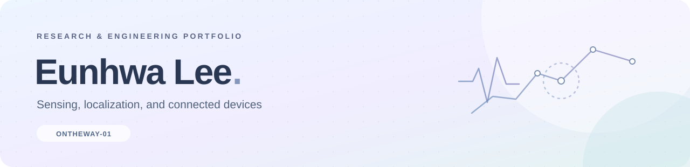

# 이은화 · Research & Engineering

**센서 신호를 처리하고, 기기의 위치와 시간을 맞추며, 연구 아이디어를 동작하는 시스템으로 구현합니다.**

중앙대학교 HCSLAB 석사과정으로 모바일·웨어러블 센싱을 연구하고 있습니다. 2027년 2월 졸업 예정입니다. MATLAB 기반 음향 신호처리, 모바일 위치 추정과 웨어러블 데이터 수집을 연구하며 Fusion·Bambu Lab을 활용한 실물 프로토타입을 제작해 왔습니다. 의료 환경에서 출발한 연구 경험을 바탕으로 센서·모바일·디바이스 R&D에 관심을 두고 있습니다.

[GitHub](https://github.com/Ontheway-01) · [HCSLAB](https://hcslab.cau.ac.kr/) · [Email](mailto:eunhwa813@cau.ac.kr)

## Selected research

### 01. Smartphone heart-sound sensing

**스마트폰 기반 심음 신호 분석과 모바일 시스템 개발을 수행했습니다.**

MATLAB을 활용한 데이터 분석·신호처리, 모바일 앱 구현, 센싱 프로토타입 제작을 담당했습니다.

`Signal processing` `MATLAB` `Mobile development` `Prototyping` → **[연구 경험과 담당 역할](projects/cardio.md)**

### 02. Mobile localization

**카메라와 모션 센서 데이터를 활용한 모바일 위치 추정을 연구합니다.** 측정 위치를 일관되게 파악하는 문제를 중심으로 프로토타입 구현과 데이터 분석을 다룹니다.

### 03. Wearable data collection

**모바일·웨어러블 기기에서 센서 데이터를 함께 수집하는 시스템을 연구합니다.** 기기 간 연결, 시간 기준과 수집 상태를 고려한 데이터 기록을 다룹니다.

추가 탐색 연구 · Smartphone IMU

### Exploratory research · Smartphone IMU

**iPhone 13 mini의 가속도·각속도 데이터를 MATLAB에서 분석해 GCG·SCG 측정 가능성을 탐색했습니다.** 위치별 파형 관찰과 아직 검증되지 않은 범위를 함께 정리했습니다.

`MATLAB` `IMU` `Band-pass filtering` → **[탐색 방법과 관찰 범위](projects/imu-exploration.md)**

## Selected publication

**Enabling Ubiquitous High-Fidelity Cardiac Auscultation via Integration of Smartphone and 3D Printing Technologies** 
Eunhwa Lee, Joonhee Lee, Siyun Lee, Junhyub Lee, Si-Hyuck Kang, Hyosu Kim. 
*UIST Adjunct 2025 · 제1저자 · Poster* · [ACM DOI](https://doi.org/10.1145/3746058.3758386)

[연구 이력 전체](projects/research.md)

## Engineering projects

| 프로젝트 | 기술적으로 다룬 문제 | 상세 |
| :--- | :--- | :--- |
| **Wakie-Talkie** | XTTS-v2 선정·FastAPI GPU 추론 서버, 발화 종료·재생 상태 연결, 대화 기록 저장 | [모델 연동과 음성 대화](projects/wakie-talkie.md) |
| **CoolCoolCoffee** | OCR 텍스트의 브랜드별 구조 해석, 메뉴 데이터 매칭, 시간에 따른 카페인 모델 계산 | [입력과 모델의 앱 구현](projects/coolcoolcoffee.md) |
| **CAUSW** | 게시글·댓글·투표 기능, 투표 참여·종료·재시작, API 응답과 UI 상태 연결 | [커뮤니티 기능 개발](projects/causw.md) |
| **Welcome-git** | C# Git GUI, 브랜치 관리, 커밋 그래프·상세 표시, 파일 상태 처리 | [Git 명령과 데스크톱 UI](projects/welcome-git.md) |
| **느릿 · Neurit** | 위치·사진·영수증 기록, iOS 네이티브 브리지, 초대 링크와 선택적 공유 | [개인 여행 프로젝트](projects/neurit.md) |

## Background

- **2024.09 – 2027.02 졸업 예정:** 중앙대학교 컴퓨터공학과 석사과정 · HCSLAB
- **2023년 여름 – 2024.08:** HCSLAB 학부연구생
- **2020.03 – 2024.08:** 중앙대학교 소프트웨어학부 공학사 · 조기 졸업

학부 국가우수장학금(이공계), 석사 GRS 장학금으로 전 학기 등록금 지원을 받았습니다.
