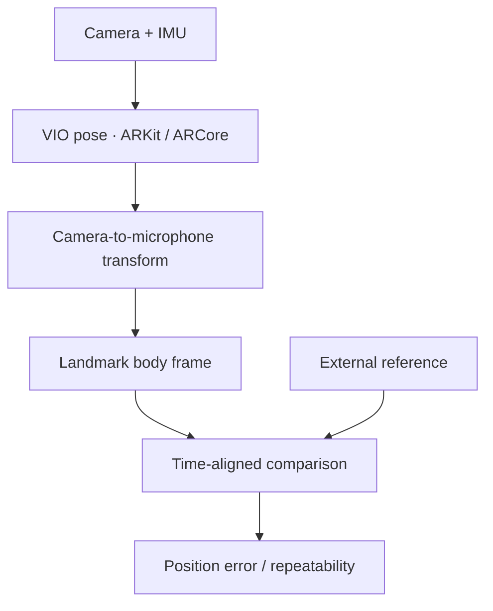

# CardioLoc · VIO-based localization

[← 포트폴리오](../README.md) · [연구 이력](research.md)

**VIO가 추정한 카메라 pose를 실제 측정 지점의 위치로 바꾸고, 서로 다른 기기·세션의 결과를 공통 좌표계와 시간축에서 비교하는 시스템을 개발했습니다.**

`Visual-inertial odometry` `Coordinate transforms` `Python` `ARKit / ARCore` `OpenVINS integration`

## 문제와 역할

VIO는 카메라와 IMU를 함께 사용해 pose를 추정하지만, SDK가 제공하는 좌표가 곧 측정하려는 마이크의 좌표는 아닙니다. 또한 각 기기의 world frame은 시작 위치·방향에 따라 달라지므로 좌표값을 그대로 비교할 수 없습니다.

CardioLoc 전반을 맡아 위치 추정 결과의 처리, 좌표계 정의, 외부 기준 비교와 분석을 수행했습니다. **ZED-2i 연결은 동료가 담당했습니다.** VIO를 활용한 측정·평가 시스템 개발이 핵심 기여입니다.

## 1. 카메라 pose에서 마이크 위치로



기기 내 카메라와 마이크 사이의 고정 offset을 카메라 좌표계에 정의하고, 매 시점의 회전·이동 변환을 적용합니다.

```text
p_mic_world = R_world_camera · p_mic_camera + t_world_camera
```

기기를 회전하면 world 좌표에서의 offset 방향도 바뀌므로 위치에 상수를 더하는 방식으로 처리할 수 없습니다. 내부 기하 계산의 meter와 전송·평가의 centimeter를 구분하고, quaternion의 성분 순서도 송신 형식에 맞춥니다.

## 2. 세 랜드마크로 공통 좌표계 정의

세션별 world frame 대신 흉골 검상돌기·쇄골·어깨의 세 점을 사용해 측정 평면을 정의했습니다. 첫 점을 원점으로 두고, 두 번째 점으로 y축을 만든 뒤, 세 번째 점의 벡터에서 y축 성분을 제거해 직교하는 x축을 만듭니다.

```text
origin = P_xiphoid
y      = normalize(P_clavicle − origin)
v      = P_shoulder − origin
x      = normalize(v − dot(v, y) · y)

body_x = dot(P − origin, x)
body_y = dot(P − origin, y)
```

이렇게 정의한 2D 좌표로 기기와 외부 기준의 측정 지점을 비교합니다. 랜드마크 입력의 오차가 전체 결과에 전파될 수 있어 보정 단계도 평가 조건으로 다룹니다.

## 3. 시간 정렬과 비교 가능한 샘플 구성

UDP로 전달한 위치·회전·timestamp와 외부 기준을 함께 분석합니다. 서로 다른 시계의 timestamp를 그대로 사용하지 않고 offset과 필요 시 scale을 적용합니다.

```text
t_sync = origin + offset + scale · (t_device − origin)
```

기본 설정은 시작 시점의 offset을 사용하는 방식이고, 별도 linear fitting 경로에서 시간에 따른 scale 차이를 다룹니다. 정렬 후에는 허용 시간차 안에서 가장 가까운 기준 샘플과 대응시킵니다. 이는 소프트웨어 기반 시간 정렬이며 하드웨어 동기화 정확도를 주장하지 않습니다.

## 4. 오차와 추적 실패를 함께 평가

정적 평가에서는 공통 평면에서 `sqrt(dx² + dy²)`를 구하고 mean·median·RMSE·P95를 집계합니다. 평균만으로 가려지는 큰 오차를 보기 위해 분포 지표를 함께 사용하며, 유효한 외부 기준 pose만 위치 오차 계산에 포함합니다.

| 평가 항목 | 확인하는 내용 |
| :--- | :--- |
| Mean / median / RMSE / P95 | 전반적인 오차와 큰 오차가 나타나는 구간 |
| Valid / failed count, failure rate | 오차 계산에 포함되지 못한 추적 실패 |
| Target별 좌표 표준편차 | 같은 지점을 반복 측정한 결과의 퍼짐 |
| 2 / 3 / 5 cm 도달률 | 정한 거리 기준 안에 들어온 측정의 비율 |

표의 거리는 **평가 기준**입니다. 달성한 정확도 수치가 아닙니다. 초기 세 점을 이용한 Kabsch 정렬은 별도 진단용으로 구분하고, 주요 평가의 신체 좌표계와 혼동하지 않도록 했습니다.

## 5. OpenVINS 모바일 연동 프로토타입

SDK 기반 구현 외에 OpenVINS의 카메라·IMU 입력과 pose 출력을 C++ wrapper로 연결하는 모바일 프로토타입을 개발했습니다. 초기화·드리프트·센서 보정 문제가 남아 있어 완성된 측위 방식으로 제시하지 않습니다. 기존 VIO 추정기를 직접 설계한 것과 모바일 입력·좌표·평가 경로를 구현한 범위를 구분합니다.

## 결과와 확인 범위

좌표와 시간의 전제를 문서화하고, 동일한 처리 규칙으로 위치 오차를 산출할 수 있는 분석 흐름을 구성했습니다. 아직 확정하지 않은 연구 결과 대신 변환식, 데이터 대응 규칙, 평가 지표를 기술 기여의 근거로 제시합니다.

연구 소스 저장소는 비공개입니다. 이 문서에는 직접 담당한 설계·구현과 평가 범위를 정리했습니다.
