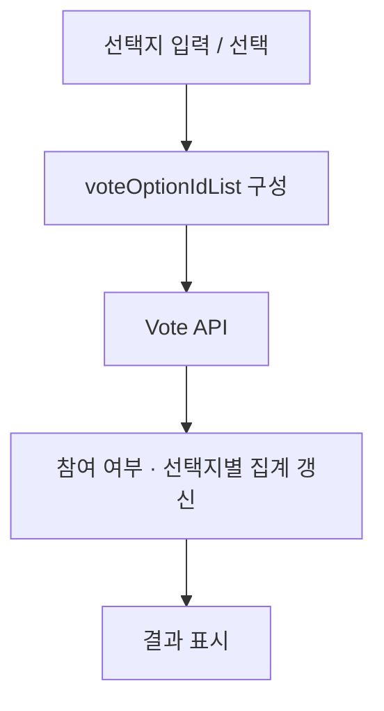

# CAUSW · Community frontend

[← 포트폴리오](../README.md) · [내 포크](https://github.com/Ontheway-01/CAUSW_frontend_V2) · [팀 원본 저장소](https://github.com/CAUCSE/CAUSW_frontend_V2)

**게시글·댓글·투표 기능을 개발하고, 사용자 동작과 API 응답에 따라 화면 상태가 바뀌는 흐름을 구현했습니다.**

`Next.js` `React` `TypeScript` `Zustand` `Axios`

## 본인 역할

팀 프론트엔드에서 게시글·댓글·대댓글·투표 기능 및 관련 수정에 기여했습니다. 아래는 본인 커밋으로 확인되는 투표 참여·종료·재시작, 선택지 입력, 좋아요 응답 처리의 사례입니다.

## 1. 투표 참여와 결과 상태 연결

투표 컴포넌트의 선택지 ID를 API 요청 DTO로 만들고, 투표 API의 응답을 받은 뒤 store의 참여 상태와 선택지별 집계를 갱신하는 흐름을 연결했습니다. 화면의 선택 상태, 서버 요청, 결과 표시가 각각 무엇을 담당하는지 나누어 처리했습니다.

투표 종료·재시작에서는 공용 API client를 통해 각 endpoint를 호출하고, 응답을 받은 뒤 store와 메뉴 표시 상태를 바꾸도록 연결했습니다. 종료 여부·참여 여부·작성자 여부에 따라 필요한 화면 동작을 다뤘습니다.

- [투표 참여 연결 · d935f60](https://github.com/CAUCSE/CAUSW_frontend_V2/commit/d935f604c94454cb2d6bc78ffea49044949494f4)
- [투표 종료·재시작 연결 · a0027c5](https://github.com/CAUCSE/CAUSW_frontend_V2/commit/a0027c575a21a2c928f027d9be3b8f181daed88d)

## 2. 입력 검증과 서버 응답을 화면에 반영

투표 선택지를 수정할 때 다른 항목과 동일한 문자열인지 확인하고, 중복 안내를 표시하는 검사를 추가했습니다. 이 변경은 프론트엔드의 입력 피드백이며 서버에서 중복 제출을 차단한다고 확대 해석하지 않습니다.

좋아요 처리에서는 화면의 숫자를 먼저 올리던 순서를 바꾸어 **성공 응답 뒤에 값을 갱신**하도록 수정했습니다. 요청을 보낸 상태와 서버 처리가 성공한 상태를 구분한 사례입니다.

- [선택지 중복 안내 · 42d07c7](https://github.com/CAUCSE/CAUSW_frontend_V2/commit/42d07c7e318e7c1f98e8966f4e53e4ac8e9638ac)
- [좋아요 성공 응답 후 갱신 · a59b7ee](https://github.com/CAUCSE/CAUSW_frontend_V2/commit/a59b7ee1)

## 3. 게시글·댓글 사용 흐름 개선

게시글 이동 시 남는 상태, 첨부 파일·이미지 표시, 댓글·대댓글 메뉴와 익명 표시 등 사용 과정에서 발생한 문제를 수정했습니다. 개별 입력 처리도 이 흐름 안에서 다뤘습니다.

보조 사례 · 한글 조합 이벤트 처리

한글 입력을 마치는 Enter와 댓글 제출 Enter가 겹치는 문제에 `isComposing` 검사를 추가했습니다. 조합 중인 입력을 제출 요청과 구분한 변경입니다.

[구현 커밋 · 0964d79](https://github.com/CAUCSE/CAUSW_frontend_V2/commit/0964d790)

## 확인 범위

팀 전체 아키텍처를 개인 설계 성과로 제시하지 않고, 본인 변경을 기준으로 기능과 상태 처리 경험을 정리했습니다. 위 커밋은 당시 구현의 근거이며 현재 서비스 전체의 동시성·오류 복구를 검증한 결과는 아닙니다.

[전체 기여 기록](https://github.com/CAUCSE/CAUSW_frontend_V2/commits?author=Ontheway-01)
