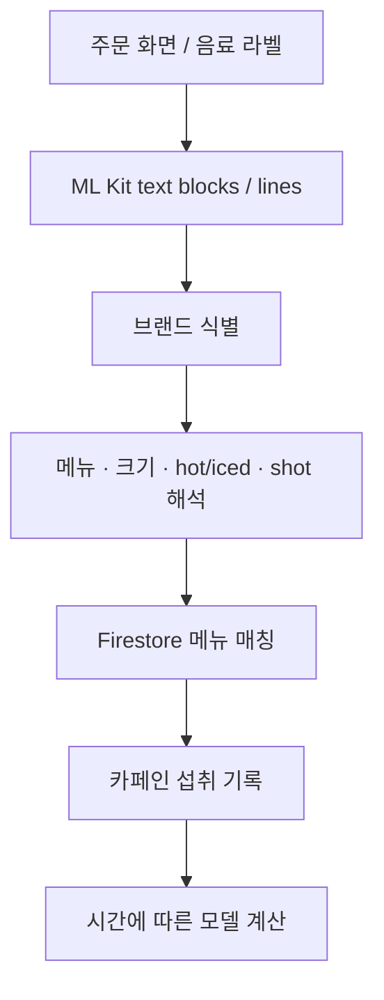

# CoolCoolCoffee · OCR & model-driven app

[← 포트폴리오](../README.md) · [내 포크](https://github.com/Ontheway-01/CoolCoolCoffee) · [팀 원본 저장소](https://github.com/CoolCoolCoffee/CoolCoolCoffee)

**수면·카페인 문헌을 앱의 계산 기능으로 옮기고, OCR 결과를 음료 데이터와 연결해 섭취 기록을 만드는 Flutter 애플리케이션을 개발했습니다.**

2023년 하반기 · 3인 캡스톤 팀 · `Flutter / Dart` `Firebase Firestore` `ML Kit Text Recognition`

## 문제와 역할

기획, 수면·카페인 관련 의학 문헌 조사, 전반적인 앱 개발과 OCR 입력을 담당했습니다. 음료 정보 입력의 부담을 줄이면서 섭취 시간과 수면 관련 정보를 함께 보여주는 것이 목표였습니다.

OCR이 반환하는 텍스트만으로는 카페인 기록을 만들 수 없습니다. 브랜드마다 다른 주문 화면에서 메뉴·크기·옵션을 해석하고, 앱의 음료 데이터와 대응시키는 처리가 필요했습니다.

## 1. OCR에서 구조화된 음료 정보로



OCR의 `TextBlock`·`TextLine`을 순회하며 브랜드별 특징 문구를 찾고, 해당 브랜드의 parser로 분기했습니다. 브랜드별 parser는 표기 차이에 맞춰 메뉴명·사이즈·샷 옵션·온도를 해석하고 `Cafe_brand/{brand}/menus`의 문서와 매칭합니다. 스타벅스 라벨은 약칭과 실제 메뉴를 연결하는 별도 매핑을 사용합니다.

일부 OCR 표기 변형도 규칙에 포함했습니다. 다만 이는 **지원 브랜드의 형식에 맞춘 규칙 기반 매칭**이며, 모든 주문 화면을 이해하는 범용 모델은 아닙니다. 주문 UI나 메뉴명이 바뀌면 parser와 메뉴 데이터도 함께 관리해야 합니다.

## 2. 섭취 시점과 반감기를 계산에 반영

카페인 양·섭취 시간·현재 시간·반감기를 입력으로 받는 계산 함수를 구현했습니다. 섭취 후 초기 구간을 선형으로 반영하고, 이후에는 반감기를 이용한 지수 감쇠 항을 사용합니다.

```text
초기 구간: scaled_amount × elapsed_time
이후 구간: scaled_amount × 0.5^(elapsed_time / half_life)
```

계산 결과는 앱의 수면 관련 그래프 및 정보 제공 기능에 사용합니다. 코드의 계수와 초기 구간은 모델의 가정이므로 실제 체내 농도를 측정한 값이나 개인별 수면 효과와 동일하게 해석하지 않습니다.

## 3. 데이터 처리와 사용자 이해를 함께 평가

팀은 **264명 사전 설문**, **12명 대상 일주일 사용자 테스트**를 수행했습니다. 그래프 해석, 섭취 기록 화면, 화면 전환에 대한 피드백을 검토했습니다. 이 평가는 앱 사용 경험을 살핀 것이며 수면 개선이나 의학적 효과를 입증한 결과는 아닙니다.

문헌의 변수와 식을 코드로 옮기는 작업뿐 아니라, 사용자가 어떤 값을 입력하고 결과를 어떻게 이해하는지까지 다룬 프로젝트입니다.

## 구현 범위와 후속 과제

지원 형식의 OCR 입력과 모델 계산을 연결한 학부 캡스톤 결과입니다. OCR 정확도 수치는 별도로 측정하지 않았으며, 미지원 메뉴·형식의 처리와 날짜 경계를 포함한 시간 표현은 후속 검증이 필요합니다.

<details>
<summary>구현 근거</summary>

- [camera_functions.dart](https://github.com/CoolCoolCoffee/CoolCoolCoffee/blob/main/CoolCoolCoffee_FrontEnd/lib/function/camera_functions.dart): 브랜드 식별, 옵션 해석, Firestore 메뉴 매칭
- [sleep_cal_functions.dart](https://github.com/CoolCoolCoffee/CoolCoolCoffee/blob/main/CoolCoolCoffee_FrontEnd/lib/function/sleep_cal_functions.dart): 시간·반감기 기반 계산
- [본인 기여 기록](https://github.com/CoolCoolCoffee/CoolCoolCoffee/commits?author=Ontheway-01)

</details>
