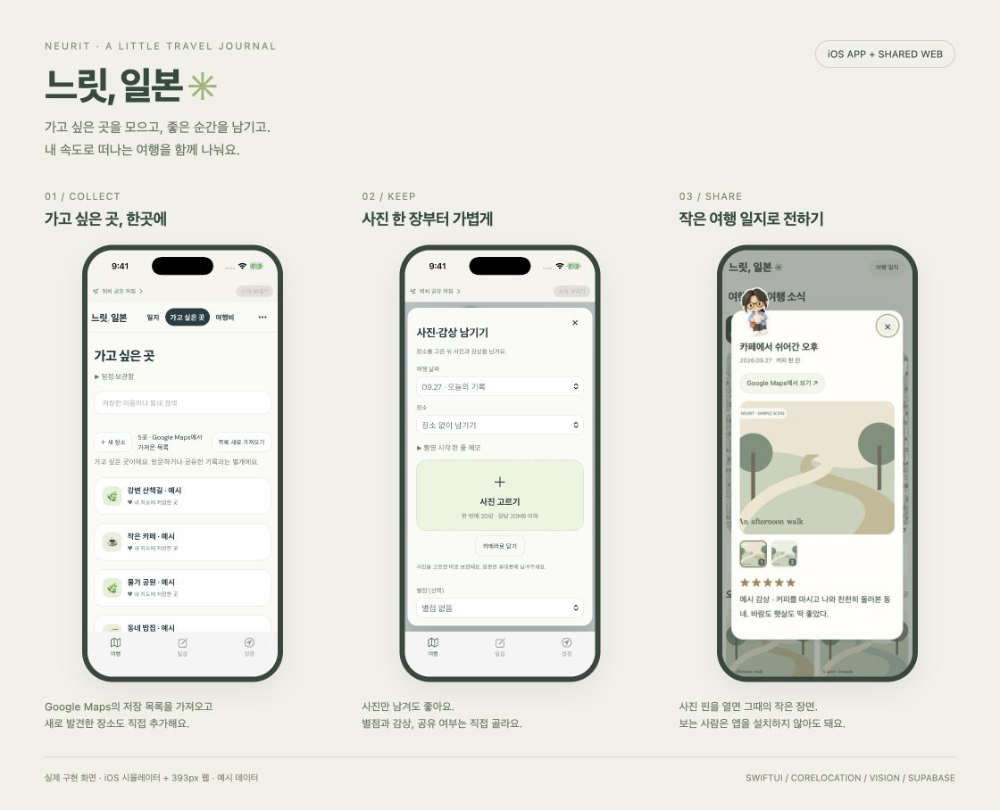

# 느릿 · Neurit

[← 포트폴리오](../README.md) · [소스 및 실행 안내](https://github.com/Ontheway-01/neurit-travel) · [샘플 데모](https://neurit-travel-window.euijefam0.chatgpt.site/?preview=1)

**여행자의 위치·사진·감상·지출을 장소 중심으로 모으고, 직접 고른 장면을 지인에게 지도로 공유하는 iOS 여행 일지입니다.**

## 문제와 접근

개인 여행을 준비하며 계획·이동 기록·사진·지출이 여러 앱에 흩어지는 불편에서 시작했습니다. 여행자에게는 장소를 중심으로 기록하는 앱을, 공유받는 사람에게는 설치 없이 하루를 둘러보는 웹 지도를 제공합니다.

**개인 기록과 공유할 장면을 분리했습니다.** 공유 중단은 새 소식의 전송을 멈추고, 숨기기·링크 닫기는 접근을 차단하는 동작으로 구분했습니다.

## 본인 역할

개인 프로젝트로 사용 시나리오·UX 방향을 정하고, 화면 및 캐릭터 피드백과 실제 기기 평가를 진행했습니다. **Codex를 활용해 구현·디버깅·테스트·문서화를 반복한 AI 보조 개발 프로젝트**입니다.

## 설계에서 설명할 수 있는 부분

| 과제 | 구현 접근 |
| :--- | :--- |
| iOS 기능과 웹 UI 연결 | SwiftUI·WKWebView와 CoreLocation·Vision OCR 네이티브 브리지 |
| 위치 기록과 전력 사용 | 이동 상태별 샘플링 정책, 명시적인 머무름에서 GPS 휴식 |
| 사진 전송량 | 썸네일·상세 이미지 분리와 상세 이미지 지연 요청 |
| 개인 기록과 초대 링크 | Supabase RLS/RPC, 링크 검증, 사진 접근 권한 재검사 |
| OCR 오류 | 추출 결과를 사용자가 수정한 뒤 지출로 확정 |
| 여행 후 보관 | 사진·영수증 포함 ZIP과 오프라인 열람, 품목 CSV, 선택 사진의 MP4 |

## 현재 단계와 근거

**실기기 검증 중인 개인용 MVP**입니다. 저장소의 [QA 기록](https://github.com/Ontheway-01/neurit-travel/blob/main/docs/qa.md), [설계 문서](https://github.com/Ontheway-01/neurit-travel/blob/main/docs/architecture.md), [화면 갤러리](https://github.com/Ontheway-01/neurit-travel/blob/main/docs/screenshots.md)에서 확인 범위를 구분했습니다.

장시간 야외 배터리 사용과 이동 중 통신 전환은 후속 검증이 필요합니다. 배터리 절감률·OCR 정확도·서비스 이용자 규모를 측정된 성과로 주장하지 않습니다. 데모와 캡처는 샘플 데이터를 사용합니다.

**기술:** SwiftUI · CoreLocation · Apple Vision · JavaScript · MapLibre · Supabase/PostgreSQL
