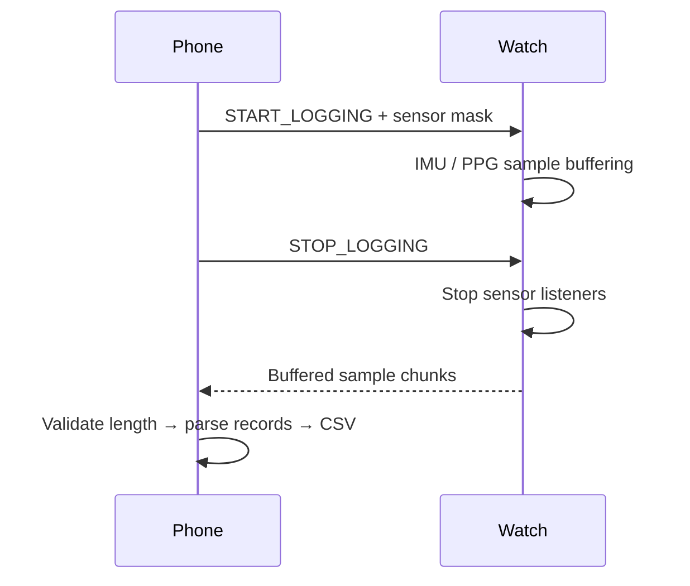

# PCWP · Multi-device data collection

[← 포트폴리오](../README.md) · [연구 이력](research.md)

**Ring–Watch–Phone의 명령, 센서 수집, 데이터 전송과 저장을 하나의 수집 절차로 연결했습니다.**

`Kotlin` `Android / Wear OS` `BLE GATT` `Coroutines` `Binary protocol`

## 문제와 역할

프로젝트 전반을 담당했습니다. 가장 어려웠던 부분은 여러 기기를 연결한 상태에서 시술 절차에 맞춰 수집 시점과 기기별 상태를 관리하는 일이었습니다. Phone이 명령을 보냈다는 사실, 기기가 명령을 수행했다는 사실, 수집 데이터가 Phone에 저장됐다는 사실을 각각 구분해야 했습니다.

## 1. 수집과 전송을 별도 단계로 구성



Watch에서는 수집 중 센서 샘플을 버퍼에 모으고, 종료 후 묶음으로 전송합니다. 측정 중의 샘플 생성과 대량 전송을 나눈 구조이며, Phone은 수신한 payload를 샘플 단위로 해석해 저장합니다. 연결·수집·전송 상태와 권한·SDK 등의 오류도 구분합니다.

이 접근은 수집 중의 전송 부담을 분리하는 대신 기기 버퍼 크기와 수집 종료 후 전송 완료를 관리해야 합니다. Ring은 별도의 명령·응답 프로토콜을 사용하므로 Watch의 패킷 형식을 공통 적용하지 않습니다.

## 2. Watch의 바이너리 레코드

Watch 전송에는 **18-byte, little-endian** 레코드를 사용합니다. 센서 종류에 따라 payload 해석이 달라집니다.

| 필드 | IMU record | PPG record |
| :--- | :--- | :--- |
| Sequence | unsigned 16-bit | unsigned 16-bit |
| Elapsed timestamp | unsigned 32-bit, μs | unsigned 32-bit, μs |
| Sensor payload | 가속도 XYZ·자이로 XYZ, 각 signed 16-bit | Green·IR·Red, 각 signed 32-bit |

Phone은 payload 길이가 record 크기의 배수인지 확인한 뒤 분할·파싱합니다. 구현 설정은 9개 record를 한 chunk에 묶는 162-byte payload와 MTU 247 요청을 사용합니다. **MTU 협상 실패 시에도 같은 크기의 전송이 보장되는 것은 아니므로**, 실제 연결 조건의 검증이 필요합니다.

IMU와 PPG의 요청 주파수는 실제 유효 샘플링률과 구분합니다. 특히 PPG는 Samsung SDK와 기기 정책의 영향을 받습니다.

## 3. Ring 명령을 ACK까지 직렬 처리

Ring 제어에는 coroutine channel을 이용한 명령 큐를 구성했습니다. 큐에서 명령을 하나씩 꺼내 BLE write를 수행하고, 일치하는 main/sub command의 ACK를 기다린 뒤 다음 명령을 처리합니다.

```text
enqueue → BLE write → wait for matching ACK → next command
                       └ ACK timeout → bounded retry
```

기본 설정은 ACK timeout 5초, 최대 3회 시도입니다. `CompletableDeferred`로 기다리는 ACK를 완료시키고, timeout 이후에는 제한된 재시도를 수행합니다. BLE write 자체의 실패는 ACK timeout과 다른 경로로 처리합니다.

이 큐는 연속 명령이 겹치는 일을 제어하지만, ACK만으로 파일 저장 완료까지 증명하지는 않습니다. 기기 명령 완료와 다운로드·저장 완료를 분리해 수집 절차를 구성했습니다.

## 4. 시간 기준과 별도 동기화 구현

샘플의 순서와 경과 시간을 레코드에 보존하고, 기기별 시간축과 사용 절차의 상태를 함께 다룹니다. 동일한 시각에 명령을 보냈다는 사실만으로 센서 샘플이 동기화됐다고 판단하지 않습니다.

저장소에는 Wear Data Layer용 4-timestamp 동기화 구현도 있습니다. Phone 송신 `T1`, Watch 수신 `T2`, Watch 송신 `T3`, Phone 수신 `T4`를 이용해 다음 값을 계산합니다.

```text
RTT                  = (T4 − T1) − (T3 − T2)
offset_watch−phone   = ((T2 − T1) + (T3 − T4)) / 2
```

Session ID·sequence·송신 timestamp로 응답을 대응시키고 초기·주기적 교환을 수행하는 코드입니다. **이 모듈은 현재 BLE 수집 경로에 연결된 것으로 확인되지 않아 별도 실험 구현으로 구분합니다.** 실제 기기 간 동기화 오차는 측정값 없이 수치화하지 않습니다.

## 결과와 확인 범위

기기 연결부터 수집 종료·전송·저장까지의 절차를 구현하고, 명령 응답과 센서 데이터를 구분해 처리했습니다. 이 사례의 핵심은 여러 기기의 상태와 패킷을 수집 목적에 맞게 조정한 경험입니다. 장시간 수집의 버퍼 사용량, MTU·연결 변경, 재시도 시 중복 명령, 기기 간 시간 오차는 실기기 검증 항목입니다.

연구 소스 저장소는 비공개입니다. 이 문서에는 직접 담당한 설계·구현과 평가 범위를 정리했습니다.
