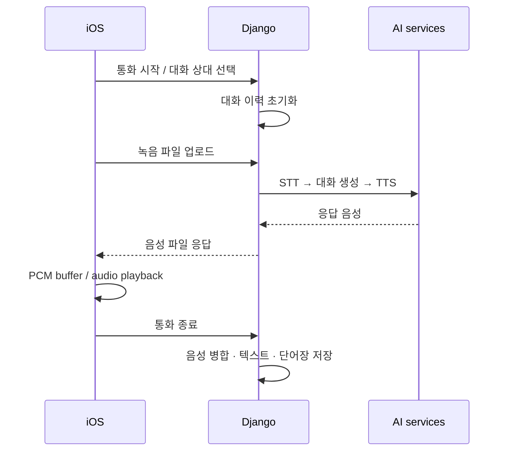

# Wakie-Talkie · Voice conversation pipeline

[← 포트폴리오](../README.md) · [프로젝트 허브](https://github.com/Ontheway-01/Wakie-Talkie) · [iOS 원본](https://github.com/Wakie-Talkie/Wakie-Talkie-frontend) · [Backend 원본](https://github.com/Wakie-Talkie/Wakie-Talkie-Backend)

**iOS의 녹음·재생과 Django 서버의 STT → 대화 생성 → TTS를 연결하고, 통화 결과를 녹음·텍스트·단어장으로 남기는 애플리케이션을 개발했습니다.**

2024년 상반기 · 3인 캡스톤 팀 · `Swift` `AVFoundation` `Python` `Django REST Framework`

## 역할과 전체 흐름

기획, 프론트엔드, 백엔드, AI 서비스 연동을 담당했습니다. 전화 알람과 언어 회화라는 사용 흐름 안에서 통화 화면, 음성 요청·응답, 대화 기록을 연결했습니다.

## 1. 음성 데이터와 재생 상태 연결

클라이언트에서 응답 데이터를 임시 오디오 파일로 읽고, `AVAudioPCMBuffer`에 담아 `AVAudioPlayerNode`에 예약하는 경로를 구현했습니다. 파일을 직접 예약하는 경로에서는 재생 완료 callback을 받아 후속 동작과 `isPlaying` 상태를 연결했습니다. 통화 화면을 닫을 때에는 player node와 audio engine을 정지·초기화합니다.

여기서 버퍼 처리는 **응답 음성의 재생을 위한 처리**입니다. 서버가 음성 조각을 생성하는 즉시 양방향으로 스트리밍하는 구조로 소개하지 않습니다.

## 2. 서버의 대화 처리와 음성 형식

업로드한 사용자 음성을 STT에 전달하고, 변환 텍스트를 대화 history에 추가한 뒤 응답을 생성합니다. 응답 텍스트는 선택한 대화 상대의 설정에 따라 TTS 경로로 전달됩니다. OpenAI TTS 경로에서는 생성한 MP3를 WAV로 변환해 반환합니다.

코드에는 STT·대화 생성·TTS 단계별 소요 시간을 기록하는 지점이 있습니다. 파이프라인 전체에서 어느 단계가 대기를 만드는지 구분하기 위한 구조이며, 측정하지 않은 응답 속도 개선율은 제시하지 않습니다.

## 3. 통화를 다시 사용할 수 있는 기록으로 변환

사용자·AI의 음성 파일을 발화 순서대로 정렬해 병합하고, 대화 텍스트를 별도 파일로 남깁니다. 통화 종료 시 대화에서 단어와 뜻·유의어·반의어·예문을 JSON 형태로 생성하도록 요청하고, 녹음 및 단어장 serializer를 통해 저장하는 흐름을 연결했습니다.

핵심은 AI API 호출에 더해 **음성 형식, 발화 순서, 재생 상태, 통화 이후의 기록**을 앱의 동작으로 묶은 경험입니다.

## 구현 범위와 후속 과제

학부 캡스톤 프로토타입입니다. 당시 서버는 process 전역의 대화 history·파일 경로·발화 index를 사용하므로, 여러 사용자의 동시 통화를 지원하려면 세션별 상태 분리와 동시성 처리가 필요합니다. 단어장 JSON의 형식 검증과 실패 복구 역시 후속 과제입니다.

구현 근거

- [클라이언트 버퍼·재생 변경 · 79c3899](https://github.com/Wakie-Talkie/Wakie-Talkie-frontend/commit/79c3899a9072737a99f85125324c563c1e0273b0)
- [AudioEngineFunc.swift](https://github.com/Wakie-Talkie/Wakie-Talkie-frontend/blob/main/Wakie-Talkie/View/CallTabViews/Functions/AudioEngineFunc.swift)
- [call_view.py](https://github.com/Wakie-Talkie/Wakie-Talkie-Backend/blob/main/wakietalkie/call_view.py): 통화 API, STT·대화·TTS, 음성 병합, 단어장 저장
- [프론트엔드 기여](https://github.com/Wakie-Talkie/Wakie-Talkie-frontend/commits?author=Ontheway-01) · [백엔드 기여](https://github.com/Wakie-Talkie/Wakie-Talkie-Backend/commits?author=Ontheway-01)

